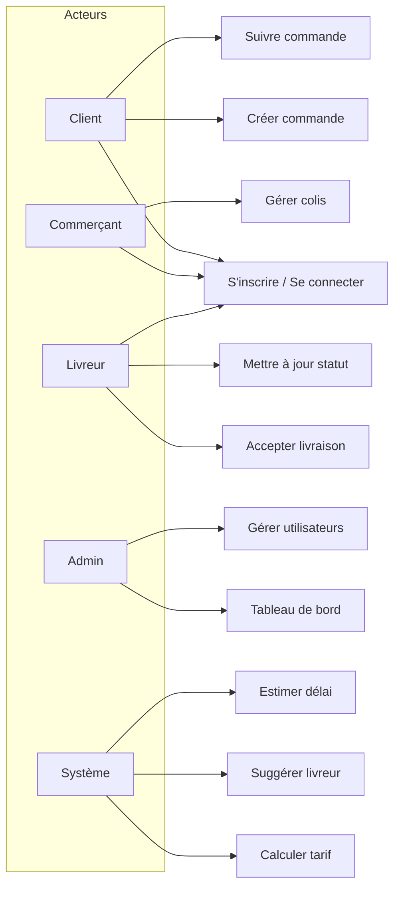
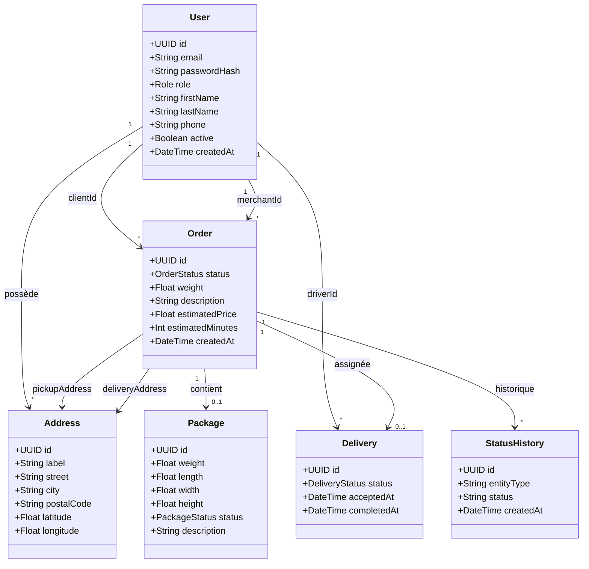
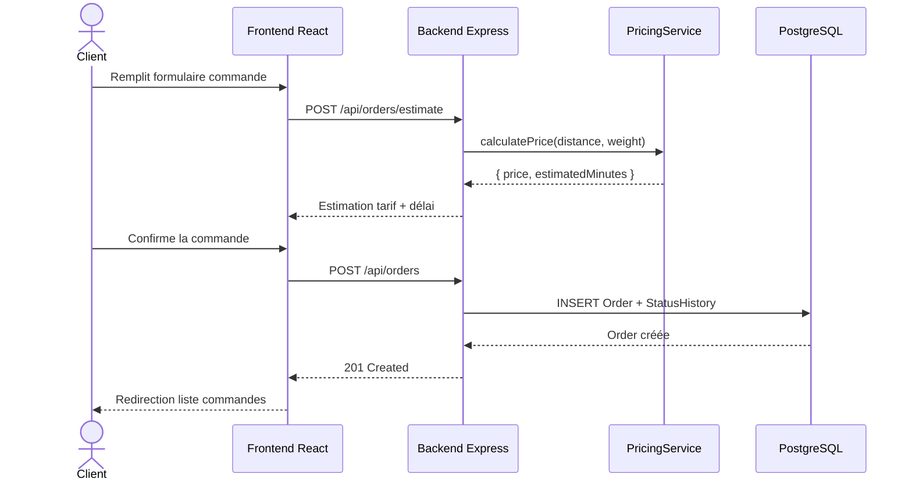
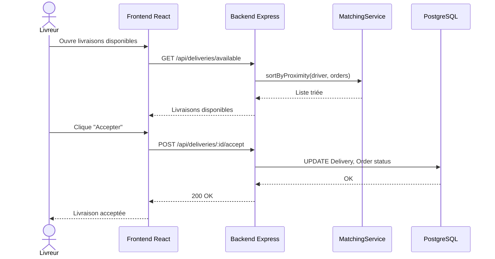
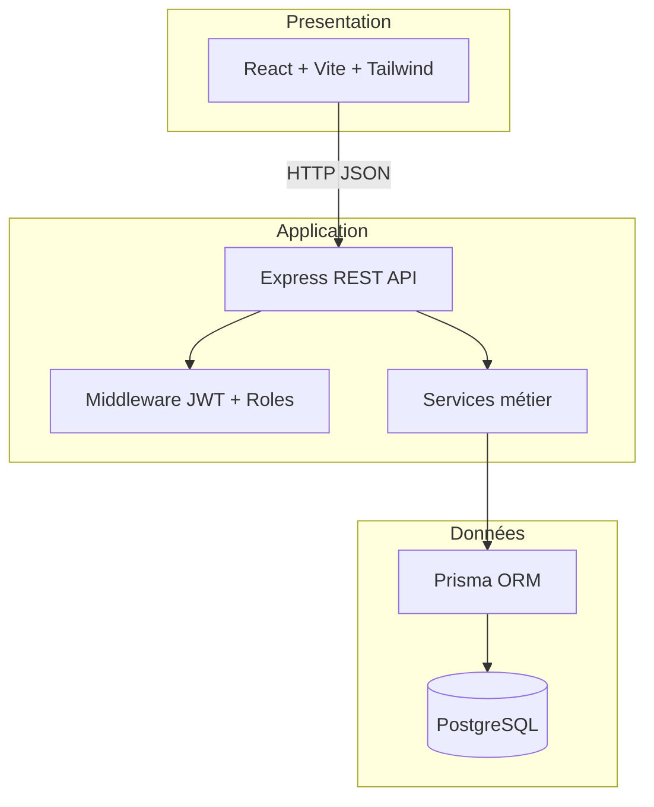

# Cahier d'analyse — kikchee

**Plateforme intelligente de logistique et de livraison multi-acteurs**

---

| | |
|---|---|
| **Projet** | kikchee |
| **Version** | 1.0 |
| **Date** | 27 mai 2026 |
| **Référence** | [Cahier des charges v1.0](01-cahier-des-charges.md) |
| **Auteur** | [Votre nom] |

---

## Table des matières

1. [Introduction](#1-introduction)
2. [Analyse des besoins](#2-analyse-des-besoins)
3. [Modélisation UML](#3-modélisation-uml)
4. [Modèle de données](#4-modèle-de-données)
5. [Architecture technique](#5-architecture-technique)
6. [Conception API REST](#6-conception-api-rest)
7. [Conception interface](#7-conception-interface)
8. [Sécurité](#8-sécurité)
9. [Algorithmes intelligents](#9-algorithmes-intelligents)
10. [Plan de tests](#10-plan-de-tests)
11. [Traçabilité CDC → Analyse → Code](#11-traçabilité-cdc--analyse--code)

---

## 1. Introduction

Ce document décrit **comment** le système kikchee sera conçu et implémenté. Il s'appuie sur le [cahier des charges](01-cahier-des-charges.md) et fixe les choix techniques, le modèle de données, l'architecture et les interfaces API.

**Objectif :** fournir une base suffisamment précise pour développer seul, sans ambiguïté entre ce qui est documenté et ce qui sera codé.

---

## 2. Analyse des besoins

### 2.1 Reformulation

| Domaine | Besoins clés |
|---------|--------------|
| Identité | Inscription multi-rôles, auth JWT, profil |
| Commande | CRUD commande client, tarif, suivi |
| Colis | CRUD colis commerçant, liaison commande |
| Livraison | File d'attente, acceptation, mise à jour statut |
| Admin | Stats, gestion users, vue globale |
| Intelligence | Tarif, proximité livreur, délai estimé |

### 2.2 Priorisation MoSCoW

| Priorité | BF concernés |
|----------|--------------|
| **Must** | BF-01 à BF-19 |
| **Should** | BF-20 |
| **Could** | Notifications email (hors MVP) |
| **Won't** | Paiement, app mobile, GPS live |

---

## 3. Modélisation UML

### 3.1 Diagramme de cas d'utilisation



### 3.2 Diagramme de classes (entités principales)



### 3.3 Diagramme de séquence — Création de commande (CU-03)



### 3.4 Diagramme de séquence — Acceptation livraison (CU-06)



---

## 4. Modèle de données

### 4.1 MCD (description textuelle)

**Entités :**

- **User** — utilisateur de la plateforme (tous rôles)
- **Address** — adresse géolocalisée (lat/lng pour calcul distance)
- **Order** — commande de livraison
- **Package** — colis physique
- **Delivery** — affectation livreur ↔ commande
- **StatusHistory** — journal des changements de statut

### 4.2 MLD (PostgreSQL)

```sql
-- Énumérations
CREATE TYPE role AS ENUM ('client', 'merchant', 'driver', 'admin');
CREATE TYPE order_status AS ENUM ('DRAFT', 'PENDING', 'ASSIGNED', 'IN_TRANSIT', 'DELIVERED', 'CANCELLED');
CREATE TYPE package_status AS ENUM ('CREATED', 'READY', 'PICKED_UP', 'DELIVERED');
CREATE TYPE delivery_status AS ENUM ('AVAILABLE', 'ACCEPTED', 'IN_PROGRESS', 'COMPLETED', 'FAILED');

-- Tables
users (
  id UUID PK,
  email VARCHAR UNIQUE NOT NULL,
  password_hash VARCHAR NOT NULL,
  role role NOT NULL,
  first_name VARCHAR NOT NULL,
  last_name VARCHAR NOT NULL,
  phone VARCHAR,
  latitude FLOAT,          -- position livreur (optionnel)
  longitude FLOAT,
  active BOOLEAN DEFAULT true,
  created_at TIMESTAMP DEFAULT NOW()
)

addresses (
  id UUID PK,
  user_id UUID FK → users,
  label VARCHAR,
  street VARCHAR NOT NULL,
  city VARCHAR NOT NULL,
  postal_code VARCHAR NOT NULL,
  latitude FLOAT NOT NULL,
  longitude FLOAT NOT NULL
)

orders (
  id UUID PK,
  client_id UUID FK → users,
  merchant_id UUID FK → users NULL,
  pickup_address_id UUID FK → addresses,
  delivery_address_id UUID FK → addresses,
  status order_status DEFAULT 'PENDING',
  weight FLOAT NOT NULL,
  description TEXT,
  estimated_price FLOAT,
  estimated_minutes INT,
  created_at TIMESTAMP DEFAULT NOW()
)

packages (
  id UUID PK,
  merchant_id UUID FK → users,
  order_id UUID FK → orders NULL,
  weight FLOAT NOT NULL,
  length FLOAT, width FLOAT, height FLOAT,
  description TEXT,
  status package_status DEFAULT 'CREATED',
  created_at TIMESTAMP DEFAULT NOW()
)

deliveries (
  id UUID PK,
  order_id UUID FK → orders UNIQUE,
  driver_id UUID FK → users NULL,
  status delivery_status DEFAULT 'AVAILABLE',
  accepted_at TIMESTAMP,
  completed_at TIMESTAMP,
  created_at TIMESTAMP DEFAULT NOW()
)

status_history (
  id UUID PK,
  order_id UUID FK → orders,
  status VARCHAR NOT NULL,
  note TEXT,
  created_at TIMESTAMP DEFAULT NOW()
)
```

### 4.3 Schéma Prisma (extrait)

```prisma
enum Role { client merchant driver admin }

model User {
  id           String   @id @default(uuid())
  email        String   @unique
  passwordHash String   @map("password_hash")
  role         Role
  firstName    String   @map("first_name")
  lastName     String   @map("last_name")
  phone        String?
  latitude     Float?
  longitude    Float?
  active       Boolean  @default(true)
  createdAt    DateTime @default(now()) @map("created_at")
  // relations...
}

model Order {
  id                String      @id @default(uuid())
  clientId          String      @map("client_id")
  merchantId        String?     @map("merchant_id")
  status            OrderStatus @default(PENDING)
  weight            Float
  description       String?
  estimatedPrice    Float?      @map("estimated_price")
  estimatedMinutes  Int?        @map("estimated_minutes")
  createdAt         DateTime    @default(now()) @map("created_at")
  // relations...
}
```

---

## 5. Architecture technique

### 5.1 Vue d'ensemble (3 tiers)



### 5.2 Stack et justifications

| Composant | Choix | Justification |
|-----------|-------|---------------|
| Runtime | Node.js 20 LTS | Même langage front/back |
| Framework API | Express 4 | Simple, documenté, middleware riche |
| ORM | Prisma | Migrations, typage TypeScript |
| BDD | PostgreSQL 14+ | Relationnel, contraintes, enums |
| Frontend | React 18 + Vite | Build rapide, composants |
| Auth | jsonwebtoken + bcrypt | Standard API stateless |
| Validation | Zod | Schémas partagés backend |
| Docs API | swagger-ui-express | Swagger UI intégré |

### 5.3 Structure des dossiers

```
APIfirst/
├── backend/
│   ├── prisma/
│   │   ├── schema.prisma
│   │   └── seed.ts              # comptes démo + admin
│   ├── src/
│   │   ├── index.ts
│   │   ├── config/
│   │   ├── middleware/
│   │   │   ├── auth.middleware.ts
│   │   │   └── role.middleware.ts
│   │   ├── routes/
│   │   │   ├── auth.routes.ts
│   │   │   ├── orders.routes.ts
│   │   │   ├── packages.routes.ts
│   │   │   ├── deliveries.routes.ts
│   │   │   └── admin.routes.ts
│   │   ├── controllers/
│   │   ├── services/
│   │   │   ├── pricing.service.ts    # BF-18, BF-20
│   │   │   └── matching.service.ts   # BF-19
│   │   └── utils/
│   │       └── haversine.ts
│   ├── package.json
│   └── .env.example
├── frontend/
│   ├── src/
│   │   ├── main.tsx
│   │   ├── App.tsx
│   │   ├── api/                 # client HTTP axios
│   │   ├── context/AuthContext.tsx
│   │   ├── components/
│   │   ├── pages/
│   │   │   ├── auth/
│   │   │   ├── client/
│   │   │   ├── merchant/
│   │   │   ├── driver/
│   │   │   └── admin/
│   │   └── routes/ProtectedRoute.tsx
│   ├── package.json
│   └── vite.config.ts
└── docs/
```

---

## 6. Conception API REST

**Base URL :** `http://localhost:3000/api`  
**Format :** JSON  
**Auth :** Header `Authorization: Bearer <token>`

### 6.1 Authentification

| Méthode | Endpoint | Rôle | BF | Description |
|---------|----------|------|-----|-------------|
| POST | `/auth/register` | Public | BF-01 | Inscription |
| POST | `/auth/login` | Public | BF-02 | Connexion → JWT |
| GET | `/auth/me` | Auth | BF-03 | Profil courant |
| PATCH | `/auth/me` | Auth | BF-03 | Modifier profil |

**POST /auth/register — Body :**
```json
{
  "email": "client@demo.fr",
  "password": "Demo1234!",
  "firstName": "Jean",
  "lastName": "Dupont",
  "phone": "0612345678",
  "role": "client"
}
```

**Réponse 201 :**
```json
{
  "id": "uuid",
  "email": "client@demo.fr",
  "role": "client",
  "firstName": "Jean",
  "lastName": "Dupont"
}
```

### 6.2 Commandes (Client)

| Méthode | Endpoint | Rôle | BF | Description |
|---------|----------|------|-----|-------------|
| POST | `/orders/estimate` | client | BF-07, BF-18, BF-20 | Estimer tarif et délai |
| POST | `/orders` | client | BF-04 | Créer commande |
| GET | `/orders` | client | BF-05 | Mes commandes |
| GET | `/orders/:id` | client | BF-06 | Détail + timeline |
| GET | `/orders/:id/track` | client | BF-06 | Suivi statut |

**POST /orders/estimate — Body :**
```json
{
  "pickupAddress": { "street": "1 rue A", "city": "Paris", "postalCode": "75001", "latitude": 48.86, "longitude": 2.35 },
  "deliveryAddress": { "street": "10 av B", "city": "Paris", "postalCode": "75008", "latitude": 48.87, "longitude": 2.31 },
  "weight": 2.5
}
```

**Réponse 200 :**
```json
{
  "estimatedPrice": 12.50,
  "estimatedMinutes": 45,
  "distanceKm": 3.2
}
```

### 6.3 Colis (Commerçant)

| Méthode | Endpoint | Rôle | BF | Description |
|---------|----------|------|-----|-------------|
| POST | `/packages` | merchant | BF-08 | Créer colis |
| GET | `/packages` | merchant | BF-10 | Mes colis |
| PATCH | `/packages/:id/link-order` | merchant | BF-09 | Lier à une commande |
| PATCH | `/packages/:id/status` | merchant | BF-10 | Marquer READY |

### 6.4 Livraisons (Livreur)

| Méthode | Endpoint | Rôle | BF | Description |
|---------|----------|------|-----|-------------|
| GET | `/deliveries/available` | driver | BF-11, BF-19 | Livraisons triées par proximité |
| POST | `/deliveries/:orderId/accept` | driver | BF-12 | Accepter |
| PATCH | `/deliveries/:id/status` | driver | BF-13 | IN_PROGRESS, COMPLETED, FAILED |
| GET | `/deliveries/mine` | driver | BF-14 | Historique |

**PATCH /deliveries/:id/status — Body :**
```json
{ "status": "IN_PROGRESS" }
```

### 6.5 Administration

| Méthode | Endpoint | Rôle | BF | Description |
|---------|----------|------|-----|-------------|
| GET | `/admin/stats` | admin | BF-15 | KPIs tableau de bord |
| GET | `/admin/users` | admin | BF-16 | Liste utilisateurs |
| PATCH | `/admin/users/:id/active` | admin | BF-16 | Activer / désactiver |
| GET | `/admin/orders` | admin | BF-17 | Toutes les commandes |
| GET | `/admin/deliveries` | admin | BF-17 | Toutes les livraisons |

**GET /admin/stats — Réponse :**
```json
{
  "totalUsers": 42,
  "totalOrders": 128,
  "completedDeliveries": 95,
  "averageDeliveryMinutes": 38,
  "ordersByStatus": { "PENDING": 10, "IN_TRANSIT": 5, "DELIVERED": 95 }
}
```

### 6.6 Codes HTTP et erreurs

| Code | Usage |
|------|-------|
| 200 | Succès GET/PATCH |
| 201 | Création réussie |
| 400 | Données invalides |
| 401 | Non authentifié |
| 403 | Rôle insuffisant |
| 404 | Ressource introuvable |
| 409 | Conflit (livraison déjà prise) |

**Format erreur :**
```json
{ "error": "Message en français", "code": "ORDER_NOT_FOUND" }
```

---

## 7. Conception interface

### 7.1 Pages par rôle

| Rôle | Pages | BF |
|------|-------|-----|
| **Public** | `/login`, `/register` | BF-01, BF-02 |
| **Client** | `/client/orders`, `/client/orders/new`, `/client/orders/:id` | BF-04–07 |
| **Commerçant** | `/merchant/packages`, `/merchant/packages/new` | BF-08–10 |
| **Livreur** | `/driver/available`, `/driver/mine`, `/driver/:id` | BF-11–14 |
| **Admin** | `/admin/dashboard`, `/admin/users`, `/admin/orders` | BF-15–17 |
| **Tous** | `/profile` | BF-03 |

### 7.2 Wireframes (description)

**Page — Nouvelle commande (Client) :**
```
┌─────────────────────────────────────────┐
│ kikchee          [Profil] [Déconnexion]│
├─────────────────────────────────────────┤
│ Nouvelle commande                       │
│ ┌ Adresse de collecte ────────────────┐ │
│ │ Rue, Ville, Code postal             │ │
│ └─────────────────────────────────────┘ │
│ ┌ Adresse de livraison ───────────────┐ │
│ │ Rue, Ville, Code postal             │ │
│ └─────────────────────────────────────┘ │
│ Poids (kg): [____]  Description: [____] │
│ ┌ Estimation ─────────────────────────┐ │
│ │ Tarif: 12,50 €  |  Délai: ~45 min   │ │
│ └─────────────────────────────────────┘ │
│         [Estimer]  [Confirmer commande] │
└─────────────────────────────────────────┘
```

**Page — Livraisons disponibles (Livreur) :**
```
┌─────────────────────────────────────────┐
│ Livraisons disponibles (triées par prox.)│
├─────────────────────────────────────────┤
│ #128 | Paris 75001 → 75008 | 3.2 km    │
│ Poids 2.5 kg | Tarif 12,50 €  [Accepter]│
├─────────────────────────────────────────┤
│ #127 | ...                              │
└─────────────────────────────────────────┘
```

### 7.3 Navigation

- Menu latéral ou header adapté au rôle connecté
- Redirection automatique après login selon `user.role`
- Route protégée : accès refusé si mauvais rôle → page 403

---

## 8. Sécurité

| Mesure | Implémentation |
|--------|----------------|
| Hash mot de passe | bcrypt, 10 rounds |
| Token JWT | Payload : `{ userId, role }`, expiry 24h |
| Secret JWT | Variable `JWT_SECRET` dans `.env` |
| Contrôle rôle | Middleware `requireRole('client')` |
| Validation entrées | Zod sur chaque route POST/PATCH |
| CORS | Origine frontend uniquement (`localhost:5173`) |
| Compte désactivé | Vérification `user.active` à chaque requête auth |

---

## 9. Algorithmes intelligents

### 9.1 Calcul du tarif (BF-18)

**Fichier :** `backend/src/services/pricing.service.ts`

**Constantes (configurables) :**
```
TARIF_BASE = 5.00 €
COEF_DISTANCE = 1.20 €/km
COEF_POIDS = 0.50 €/kg
SUPPLEMENT_ZONE_LOINTAINE = 3.00 €  (si distance > 15 km)
```

**Pseudo-code :**
```
function calculatePrice(distanceKm, weightKg):
    price = TARIF_BASE
    price += distanceKm * COEF_DISTANCE
    price += weightKg * COEF_POIDS
    if distanceKm > 15:
        price += SUPPLEMENT_ZONE_LOINTAINE
    return round(price, 2)
```

### 9.2 Distance Haversine (BF-19)

**Fichier :** `backend/src/utils/haversine.ts`

```
function haversine(lat1, lon1, lat2, lon2):
    R = 6371  // rayon Terre en km
    dLat = toRad(lat2 - lat1)
    dLon = toRad(lon2 - lon1)
    a = sin(dLat/2)² + cos(lat1) * cos(lat2) * sin(dLon/2)²
    c = 2 * atan2(sqrt(a), sqrt(1-a))
    return R * c
```

**Matching livreur :**
```
function sortOrdersByProximity(driver, availableOrders):
    for each order in availableOrders:
        order.distance = haversine(driver.lat, driver.lng, order.pickup.lat, order.pickup.lng)
    return sort ascending by order.distance
```

### 9.3 Estimation délai (BF-20)

```
VITESSE_MOYENNE_KMH = 25
MARGE_PREPARATION_MIN = 15

function estimateMinutes(distanceKm):
    travel = (distanceKm / VITESSE_MOYENNE_KMH) * 60
    return ceil(travel + MARGE_PREPARATION_MIN)
```

---

## 10. Plan de tests

### 10.1 Tests manuels par scénario

| ID | Scénario | Résultat attendu |
|----|----------|------------------|
| T-01 | Inscription client | Compte créé, redirection login |
| T-02 | Login mauvais mot de passe | Erreur 401 |
| T-03 | Client crée commande | Commande PENDING, tarif calculé |
| T-04 | Commerçant lie colis | Package lié, statut READY |
| T-05 | Livreur accepte | Delivery ACCEPTED, Order ASSIGNED |
| T-06 | Livreur marque livré | Order DELIVERED, timeline mise à jour |
| T-07 | Client accès route admin | Erreur 403 |
| T-08 | Admin désactive user | User ne peut plus login |

### 10.2 Tests unitaires (services)

| Service | Test |
|---------|------|
| `pricing.service` | distance 0 km, poids 1 kg → tarif base + coef poids |
| `haversine` | Paris → Paris (~0 km) |
| `matching.service` | 2 commandes, livreur plus proche de la première |

### 10.3 Comptes de démonstration (seed)

| Email | Mot de passe | Rôle |
|-------|--------------|------|
| admin@logiflow.fr | Admin1234! | admin |
| client@demo.fr | Demo1234! | client |
| merchant@demo.fr | Demo1234! | merchant |
| driver@demo.fr | Demo1234! | driver |

---

## 11. Traçabilité CDC → Analyse → Code

| BF | CDC | Endpoint / Service | Page frontend |
|----|-----|-------------------|---------------|
| BF-01 | §3.1 | POST /auth/register | /register |
| BF-02 | §3.1 | POST /auth/login | /login |
| BF-03 | §3.1 | GET/PATCH /auth/me | /profile |
| BF-04 | §3.2 | POST /orders | /client/orders/new |
| BF-05 | §3.2 | GET /orders | /client/orders |
| BF-06 | §3.2 | GET /orders/:id/track | /client/orders/:id |
| BF-07 | §3.2 | POST /orders/estimate | /client/orders/new |
| BF-08 | §3.3 | POST /packages | /merchant/packages/new |
| BF-09 | §3.3 | PATCH /packages/:id/link-order | /merchant/packages |
| BF-10 | §3.3 | GET /packages | /merchant/packages |
| BF-11 | §3.4 | GET /deliveries/available | /driver/available |
| BF-12 | §3.4 | POST /deliveries/:orderId/accept | /driver/available |
| BF-13 | §3.4 | PATCH /deliveries/:id/status | /driver/:id |
| BF-14 | §3.4 | GET /deliveries/mine | /driver/mine |
| BF-15 | §3.5 | GET /admin/stats | /admin/dashboard |
| BF-16 | §3.5 | GET/PATCH /admin/users | /admin/users |
| BF-17 | §3.5 | GET /admin/orders | /admin/orders |
| BF-18 | §3.6 | pricing.service | (auto) |
| BF-19 | §3.6 | matching.service | /driver/available |
| BF-20 | §3.6 | pricing.service | /client/orders/new |

---

*Document validé pour passage à l'étape 3 — Setup et développement backend.*
